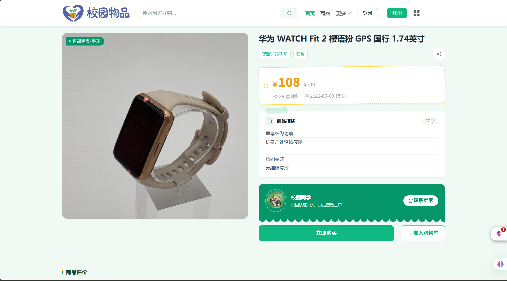
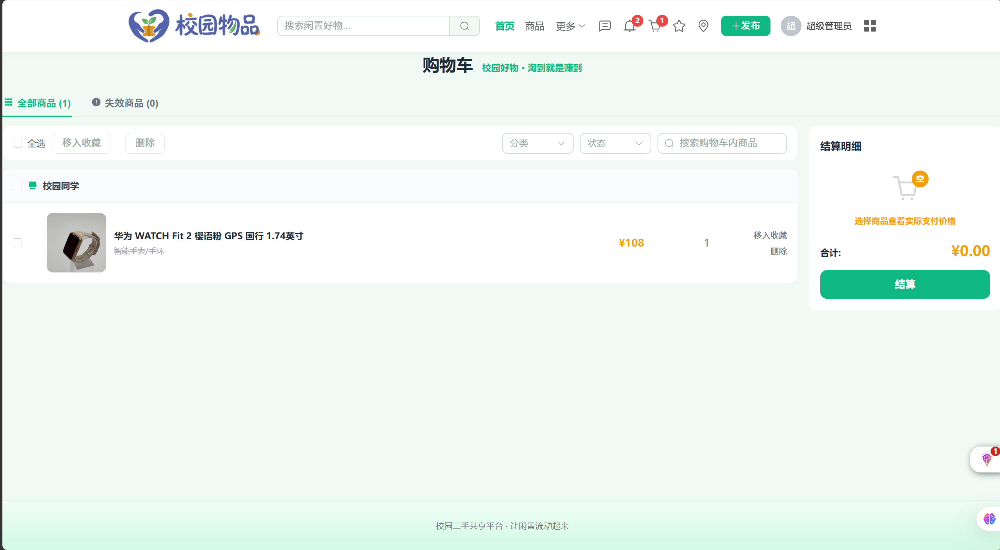
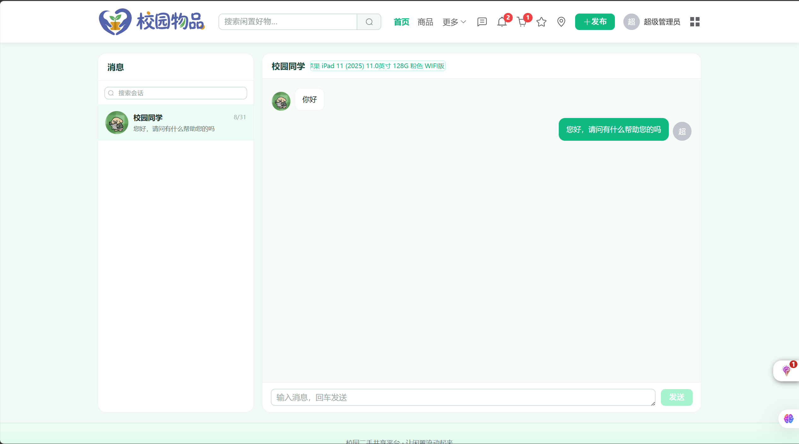
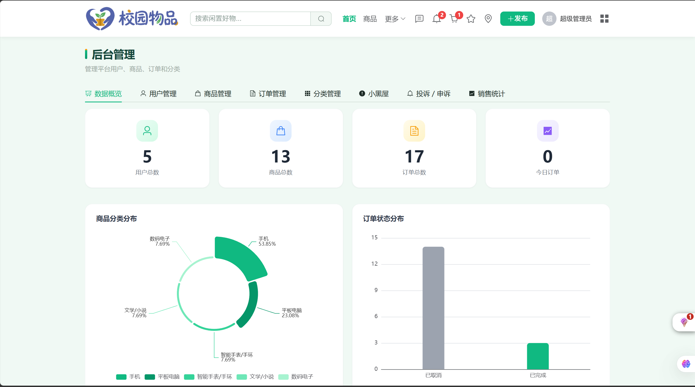
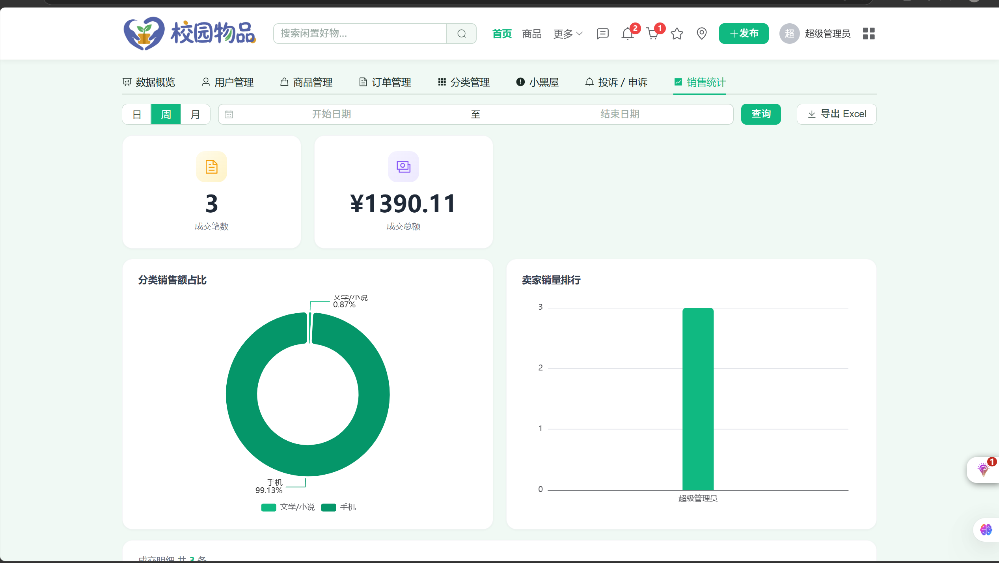

<div align="center">

# 校园二手物品共享平台

**基于 Spring Boot 3 + Vue 3 的全功能校园二手交易平台**

[](https://spring.io/projects/spring-boot)
[](https://vuejs.org/)
[](https://openjdk.org/)
[](https://www.mysql.com/)
[](LICENSE)

</div>

---

## 项目简介

面向高校学生的二手物品交易平台，采用前后端分离架构。覆盖商品发布与检索、购物车、订单流转、支付宝沙箱支付、即时聊天、后台管理与数据可视化等完整电商链路。

## 页面预览

| | |
|:---:|:---:|
| **首页** | **商品详情** |
|  |  |
| **购物车** | **实时聊天** |
|  |  |
| **后台数据概览** | **销售统计** |
|  |  |

## 技术栈

| 层级 | 技术选型 |
|:---:|:---|
| **后端** | Spring Boot 3.3 · Java 17 · MyBatis-Plus 3.5.9 · JJWT 0.12.6 (HMAC-SHA384) |
| **数据层** | MySQL 8.0 · Redis 6+ (Lettuce) |
| **前端** | Vue 3 · Vite · Element Plus · Pinia · Vue Router 4 · Axios |
| **可视化** | ECharts · qrcode |
| **支付** | 支付宝沙箱 (alipay-sdk-java 4.39) · 微信模拟收银台 |
| **工具** | EasyExcel 3.3.4 · Hutool 5.8.25 · Lombok · BCrypt |

## 功能模块

| 模块 | 功能要点 |
|:---:|:---|
| **用户** | 注册/登录 · 校园认证 · 个人资料 · 收货地址 · 消息通知 |
| **商品** | 发布/编辑/下架 · 分类筛选 · 关键词搜索 · 多维排序 · 收藏 |
| **购物车** | 按卖家分组 · 全选/单选 · 失效管理 · 结算下单 |
| **订单** | 30 分钟超时取消 · 退款/售后 · 平台仲裁 · 状态流转 |
| **支付** | 支付宝沙箱扫码付 (RSA2) · 微信模拟收银台 · 异步回调验签 |
| **聊天** | WebSocket 实时通信 · 买卖双端点对点 |
| **管理** | 数据看板 · 用户/商品/订单管理 · 投诉仲裁 · Excel 导出 · 销售统计 |

### 订单状态流转

```
待付款 ──→ 已付款 ──→ 已发货 ──→ 已完成
  │
  └──→ 已取消

退款：申请 → 卖家同意/拒绝 → 平台仲裁 → 退款/维持
```

## 设计规范

| 元素 | 规格 |
|:---:|:---|
| 主题色 | `#10B981` 翠绿 |
| 强调色 | `#F59E0B` 暖橙 |
| 背景色 | `#F0F9F4` 浅绿底 |
| 字体 | Helvetica Neue / PingFang SC / Microsoft YaHei |
| 卡片圆角 | 12px · 按钮圆角 6px |

## 快速启动

### 环境要求

- JDK 17+
- Maven 3.6+
- MySQL 8.0
- Redis 6+
- Node.js 18+

### 1. 克隆仓库

```bash
git clone https://github.com/mengshiquan/SecondHand-Shared-system.git
cd SecondHand-Shared-system
```

### 2. 初始化数据库

```bash
mysql -u root -p < sql/schema.sql
```

> `schema.sql` 为完整版建库脚本，新环境只需导入这一个文件。老库升级按需执行 `sql/migration_*.sql`。

修改 `backend/src/main/resources/application.yml` 中的数据库和 Redis 连接信息（支持环境变量：`DB_USERNAME`、`DB_PASSWORD`、`REDIS_HOST`）。

### 3. 启动后端

```bash
cd backend
# Windows
set JAVA_HOME=D:\java\jdk17
mvn spring-boot:run

# Linux/Mac
export JAVA_HOME=/path/to/jdk17
mvn spring-boot:run
```

> 后端运行在 `http://localhost:8080/api`

### 4. 启动前端

```bash
cd frontend
npm install
npm run dev
```

> 前端运行在 `http://localhost:5173`，Vite 已配置 `/api` 代理转发到后端 8080 端口。

## 支付配置

在 `application.yml` 的 `pay.alipay` 段配置沙箱凭据：

```yaml
pay:
  alipay:
    app-id: ${ALIPAY_APP_ID:}
    private-key: ${ALIPAY_PRIVATE_KEY:}
    alipay-public-key: ${ALIPAY_PUBLIC_KEY:}
    gateway: https://openapi-sandbox.dl.alipaydev.com/gateway.do
    notify-url: http://localhost:8080/api/pay/alipay/notify
```

- 凭据从 [支付宝沙箱控制台](https://open.alipay.com/develop/sandbox/app) 获取，建议用环境变量注入
- 留空时支付宝选项不可用，微信模拟支付不受影响
- 本地无公网时回调不可达，由轮询接口主动查询补单

## 演示账号

| 用户名 | 密码 | 角色 |
|:---:|:---:|:---:|
| `admin` | `admin` | 管理员 |
| `student` | `123456` | 普通用户 |

## API 接口

| 模块 | 路径前缀 | 主要接口 |
|:---:|:---:|:---|
| 用户 | `/user` | 登录 · 注册 · 资料 · 密码 · 认证 |
| 商品 | `/product` | 列表 · 详情 · 发布 · 编辑 · 下架 |
| 购物车 | `/cart` | 加购 · 列表 · 删除 · 结算 |
| 地址 | `/address` | 增删改查 · 设为默认 |
| 订单 | `/order` | 创建 · 列表 · 发货 · 收货 · 退款 · 仲裁 |
| 支付 | `/pay` | 支付宝预下单 · 回调 · 微信模拟 · 状态轮询 |
| 收藏 | `/favorite` | 收藏/取消 · 列表 |
| 评论 | `/comment` | 发表 · 列表 |
| 通知 | `/notification` | 列表 · 未读数 · 已读 |
| 文件 | `/file` | 图片上传 |
| 后台 | `/admin` | 看板 · 用户/商品/订单管理 · 仲裁 · 导出 |

### 统一返回格式

```json
{
  "code": 200,
  "message": "操作成功",
  "data": {}
}
```

- `code: 200` — 业务成功
- `code: 401` — 未登录或令牌过期
- `code: 500` — 业务异常（`message` 含错误原因）

## 项目结构

```
SecondHand-Shared-system/
├── backend/              # Spring Boot 后端
│   └── src/main/java/com/campus/secondhand/
│       ├── controller/   # REST 接口层
│       ├── service/      # 业务逻辑层
│       ├── entity/       # 数据实体
│       ├── mapper/       # MyBatis-Plus Mapper
│       ├── config/       # 配置（JWT/WebSocket/MVC）
│       └── common/       # 统一响应/异常处理
├── frontend/             # Vue 3 前端
│   └── src/
│       ├── views/        # 页面组件
│       ├── components/   # 通用组件
│       ├── api/          # 接口封装
│       ├── stores/       # Pinia 状态管理
│       ├── router/       # 路由配置
│       └── utils/        # 工具函数
├── sql/                  # 数据库脚本
├── docs/                 # 设计文档
└── README.md
```

## License

[MIT](LICENSE)
